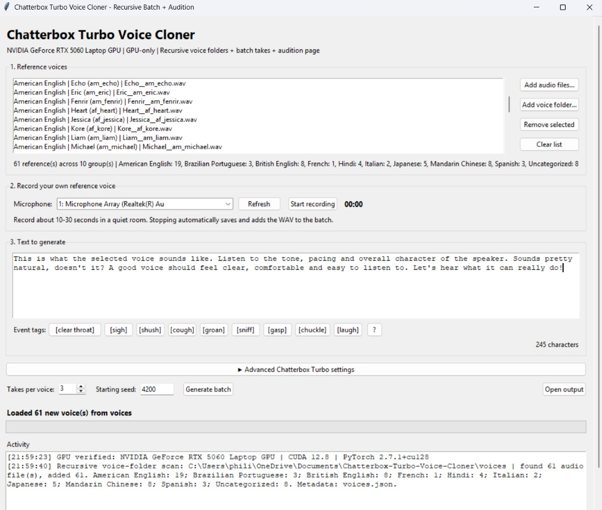
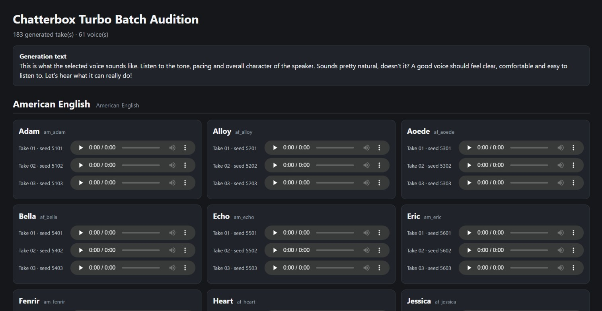

# Chatterbox Turbo Voice Cloner

A Windows desktop GUI for **Chatterbox Turbo** voice cloning, batch generation and voice auditioning.

The repository intentionally contains **only the project source and reference assets**. The Python virtual environment, PyTorch/CUDA packages, downloaded model files, generated output and local BAT launchers are not committed. Those dependencies can consume several gigabytes and are created locally after cloning.

## Features

- Clone a voice from a reference audio clip
- Load individual files or recursively scan organized voice folders
- Record a reference clip directly from a microphone
- Generate multiple takes per voice with reproducible seeds
- Batch-generate many reference voices at once
- Built-in Chatterbox Turbo event tags such as `[laugh]`, `[sigh]` and `[chuckle]`
- Advanced sampling controls for temperature, Top P, Top K and repetition penalty
- Automatic WAV output and batch manifests
- Browser-based audition page for comparing generated takes
- Selection helper that copies chosen takes into a separate folder
- Included Kokoro reference-voice pack with metadata

## Default generation text

The application starts with this audition text:

> This is what the selected voice sounds like. Listen to the tone, pacing and overall character of the speaker. Sounds pretty natural, doesn't it? A good voice should feel clear, comfortable and easy to listen to. Let's hear what it can really do!

## Requirements

- Windows 10 or Windows 11
- Python 3.12 recommended for the tested setup
- CUDA-capable NVIDIA GPU
- Current NVIDIA driver compatible with the CUDA 12.8 PyTorch build used in `BUILD.md`
- Internet connection for the initial dependency/model download

The app intentionally does not fall back to CPU generation. The original private build was tested on an RTX 5060, but the public version no longer hard-codes a Blackwell/`sm_120` requirement. It instead verifies that PyTorch can actually use the installed CUDA GPU.

## Install

BAT files are intentionally ignored by Git so machine-specific launch/install helpers do not get committed.

Follow **[BUILD.md](BUILD.md)** to create:

- `install.bat`
- `run.bat`
- optional `run_console.bat` for troubleshooting

Then run `install.bat` once and use `run.bat` to start the application.

## Basic use

1. Start the app with `run.bat`.
2. Add a clean reference voice recording or choose one of the included reference voices.
3. Enter the text to generate.
4. Choose the number of takes and generation settings.
5. Click **Generate**.
6. Review the generated WAV files in the audition page.
7. Check the takes you want to keep and copy the selected voices.

For best cloning results, use a clean single-speaker reference with little background noise, echo, music or clipping. Chatterbox Turbo requires reference audio longer than five seconds. Roughly 10-30 seconds is a useful working range for this GUI.

## Screenshots

### Main application



### Batch audition page



## Included reference voices

The `voices/` folder contains the existing built-in reference clips plus the Kokoro reference package. Kokoro metadata includes language, voice ID, descriptions, source notes and hashes where available.

See `voices/Kokoro Voices/README.md` for the package contents and provenance.

## Project layout

```text
.
├── voice_cloner.pyw
├── verify_gpu.py
├── kokoro_voice_attributes.json
├── requirements.txt
├── BUILD.md
├── LICENSE
├── THIRD_PARTY_NOTICES.md
├── docs/
│   └── screenshots/
│       ├── main-window.jpg
│       └── audition-page.jpg
└── voices/
    └── Kokoro Voices/
```

These folders are created locally at runtime and intentionally ignored:

```text
.venv/
logs/
output/
recordings/
```

## Dependency size

The Git repository stays small because the heavy runtime is installed locally. PyTorch, CUDA libraries, Chatterbox dependencies and model caches can use several gigabytes of disk space. They do **not** belong in Git.

## Responsible use

Only clone voices you have permission to use. Do not publish or redistribute reference recordings unless you also have the right to redistribute those recordings. Voice cloning can be used to impersonate real people, so obtain consent and clearly disclose synthetic audio where appropriate.

## Upstream projects

This GUI uses Resemble AI's Chatterbox Turbo and includes reference audio generated from Kokoro voices. See **[THIRD_PARTY_NOTICES.md](THIRD_PARTY_NOTICES.md)** for attribution and upstream license information.

## Project license

This project is licensed under the **MIT License**. See [LICENSE](LICENSE) for the full license text.
